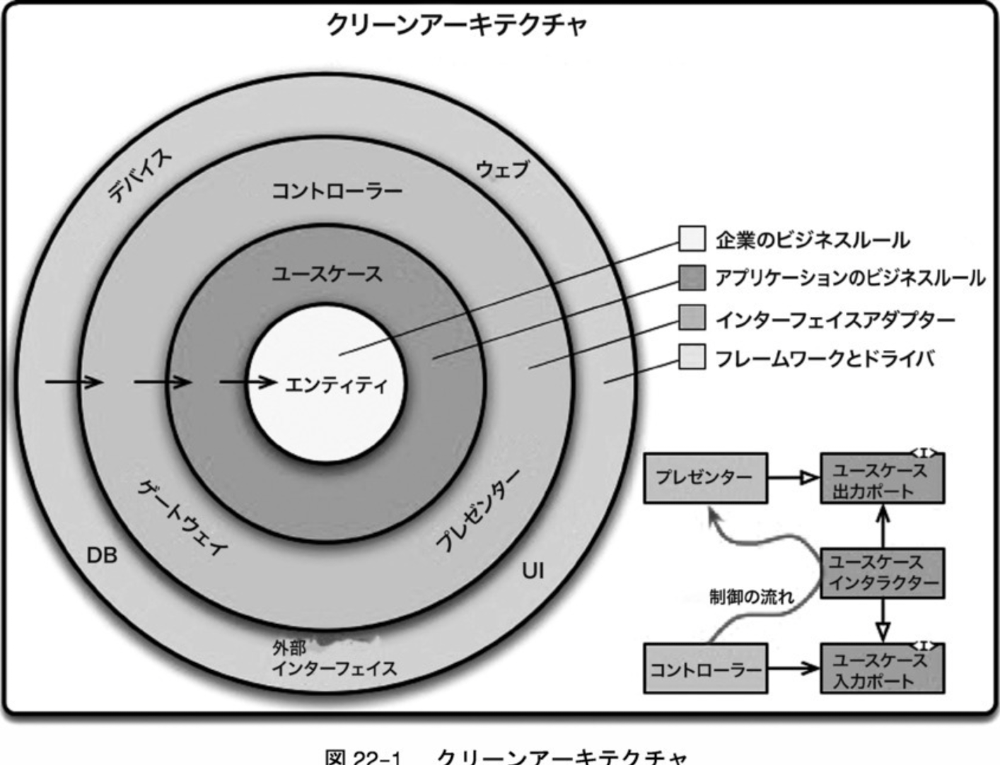

# Bookshelf API

Backend server for [Bookshelf](https://github.com/hiterm/bookshelf/).

## How to run server

### Set up Auth0

Set up auth0 by following:

https://auth0.com/developers/hub/code-samples/api/actix-web-rust/basic-authorization

### Setup .env

```sh
$ mv .env.template .env
$ vim .env  # Fill your value
```

### Run migration

```
$ cargo install sqlx-cli
$ sqlx migrate run
```

### Start server

```
$ cargo run
```

### Run via Docker Compose

```sh
$ mv .env.template .env.docker
$ vim .env.docker  # Fill your value
```

```
$ docker-compose up --build
```

## Test

```
$ cargo test
```

With DB

```
$ docker-compose -f docker-compose-test.yml up -d
$ cargo test -- --include-ignored
```

## GraphQL Playground

Run server and access `/graphql/playground`.

## Generate GraphQL schema

```
$ cargo run --bin gen_schema
```
***

### How it works as a Clean Architecture

```bash
src
├── domain  // 🟢エンティティ。最重要ビジネスルールをカプセル化したもの
│   ├── todo.rs
│   └── user.rs
├── domain.rs
├── interface_adapter // 🟢MVCを保持しているレイヤー
│   ├── controller // 🟢 リクエストを受け取り、レスポンスを返すための窓口
│   │   ├── web_todo.rs
│   │   └── web_user.rs
│   ├── controller.rs
│   ├── presenter // 🟢 Output DataからView Modelで定義されている型に変換するための処理
│   │   ├── todo.rs
│   │   └── user.rs
│   ├── presenter.rs
│   ├── viewmodel // 🟢 レスポンスの型
│   │   ├── todo.rs
│   │   └── user.rs
│   └── viewmodel.rs
├── interface_adapter.rs
├── lib.rs
├── main.rs
├── usecase // 🟢アプリケーション固有のビジネスルール
│   ├── data_access // 🟢DBの型をusecaseで使用する型と合わせる
│   │   ├── todo.rs
│   │   └── user.rs
│   ├── data_access.rs
│   ├── input_boundary // 🟢 interface_adapter→usecaseへの直接依存を防ぐためのIF(IF分離の法則)
│   │   ├── todo.rs
│   │   └── user.rs
│   ├── input_boundary.rs
│   ├── interactor // 🟢ビジネスロジック実装の定義
│   │   ├── todo.rs
│   │   └── user.rs
│   └── interactor.rs
│   ├── output_data // 🟢ユースケース層出力値の定義
│   │   ├── todo.rs
│   │   └── user.rs
│   └── output_data.rs
└── usecase.rs  // 🟢アプリケーション固有のビジネスルール
```

### `/todo`

```bash
curl -XPUT localhost:8081/todo/content -H "Content-Type: application/json" -d '{"content" : "Selected...", "id": "1" }'
```

### POST: `/user`
```bash
curl -XPOST localhost:8081/todo -H "Content-Type: application/json" -d '{"title" : "綾鷹", "content": "選ばれたのは", "user_id": "1" }'
```

### PUT: `/user`
```bash
curl -XPUT localhost:8081/todo -H "Content-Type: application/json" -d '{"title" : "綾鷹", "content": "選ばれたのは", "user_id": "1" }'
```

### PUT: `/user`
```bash
curl -XPUT localhost:8081/todo -H "Content-Type: application/json" -d '{"title" : "綾鷹", "content": "選ばれたのは", "user_id": "1" }'
```

### DELETE: `/user`
```bash
curl -XDELETE localhost:8081/todo -H "Content-Type: application/json" -d '{"id" : "1"}'
```

```bash
curl -XGET localhost:8081/todo
```

### GET: `/user`
```bash
curl -XGET localhost:8081/users
```

### POST: `/user`
```bash
curl -XPOST localhost:8081/users -H "Content-Type: application/json" -d '{"name" : "綾鷹" }'
```

### PUT: `/user/name`
```bash
curl -XPUT localhost:8081/users/name -H "Content-Type: application/json" -d '{"name" : "伊右衛門" }'
```

### DELETE: `/user`
```bash
curl -XDELETE localhost:8081/users -H "Content-Type: application/json" -d '{"id" : "1" }'
```


Ref: 
https://zenn.dev/htlsne/articles/rust-clean-architecture
https://github.com/hiterm/bookshelf-api
https://lucid.app/lucidchart/62854681-180e-4860-9d75-9c878674ba6d/edit?viewport_loc=-275%2C368%2C2917%2C1395%2C0_0&invitationId=inv_78d72729-6626-4966-a05d-d5e67e6ca173